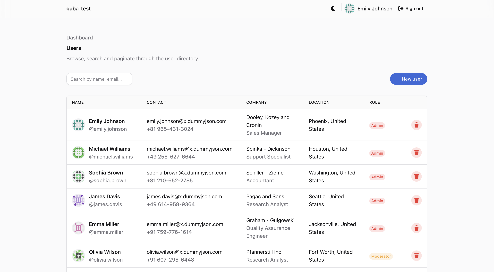
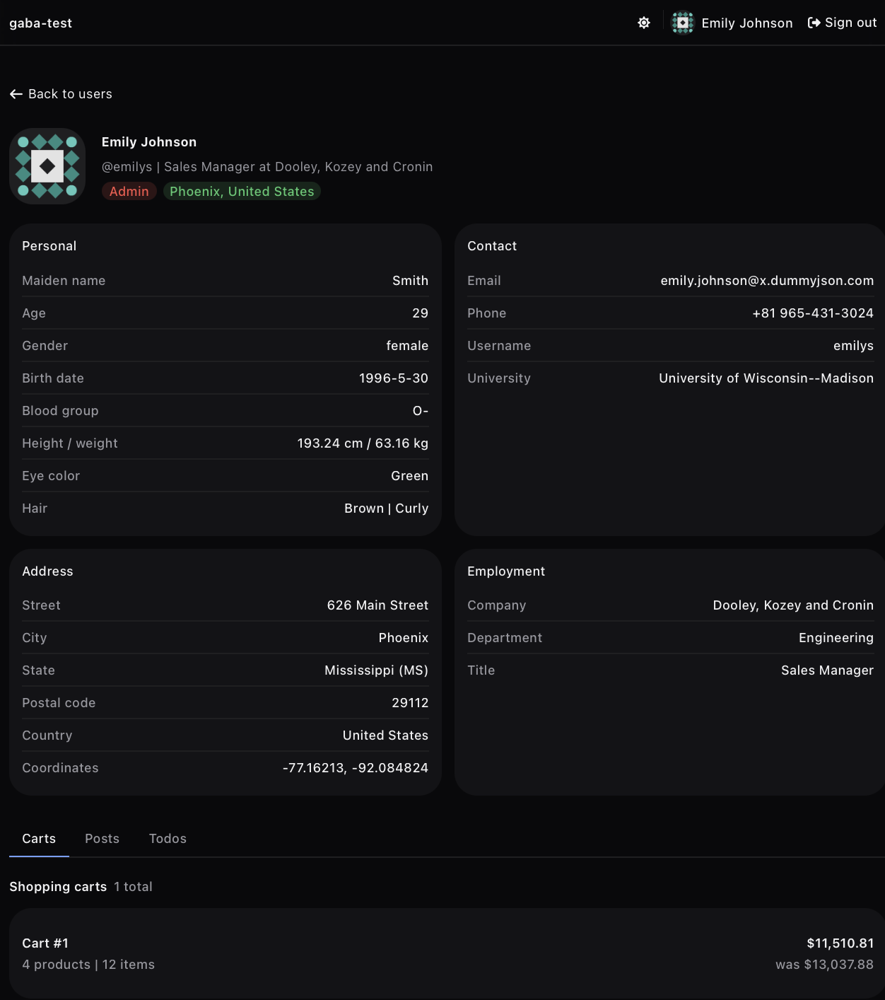
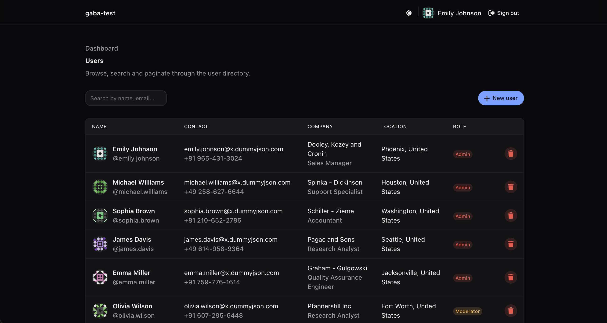
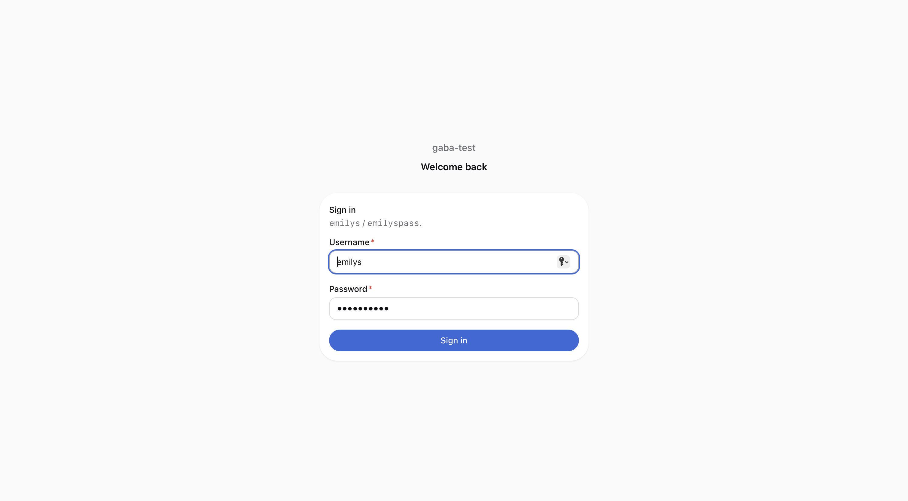
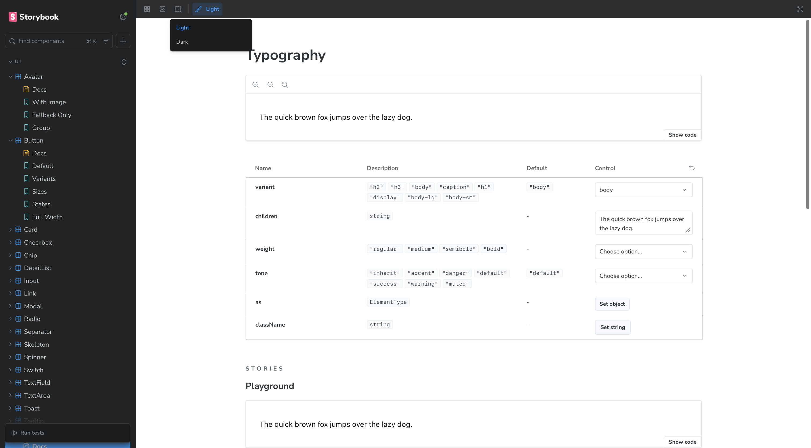

# gaba-test

Showcase-репозиторий: справочник пользователей на Next.js 16 + React 19 с Feature-Sliced архитектурой, RSC-first, Vitest + Playwright + Storybook и CI-гейтом.



---

## Содержание

- [Стек](#стек)
- [Запуск](#запуск)
- [Скрипты](#скрипты)
- [Окружение](#окружение)
- [Архитектура: Feature-Sliced Design](#архитектура-feature-sliced-design)
- [Стратегия рендеринга](#стратегия-рендеринга)
- [Данные: RSC, Server Actions, React Query](#данные-rsc-server-actions-react-query)
- [UI и дизайн-система](#ui-и-дизайн-система)
- [Формы и валидация](#формы-и-валидация)
- [Тесты](#тесты)
- [Storybook](#storybook)
- [CI](#ci)
- [Качество кода](#качество-кода)
- [Производительность и SEO](#производительность-и-seo)
- [Безопасность](#безопасность)
- [Структура проекта](#структура-проекта)
- [Что осталось за рамками](#что-осталось-за-рамками)
- [Обновление медиа](#обновление-медиа)

---

## Стек

| Слой             | Инструмент                                                              | Версия |
| ---------------- | ----------------------------------------------------------------------- | ------ |
| Фреймворк        | [Next.js](https://nextjs.org) (App Router)                              | 16.2   |
| UI               | [React](https://react.dev)                                              | 19.2   |
| Язык             | TypeScript (strict)                                                     | 5.7    |
| Раннер           | Node                                                                    | 24.x   |
| Менеджер пакетов | pnpm                                                                    | 9.15   |
| Стили            | [Tailwind CSS](https://tailwindcss.com) v4 + OKLch design tokens        | 4.x    |
| Компоненты       | [HeroUI](https://www.heroui.com) v3 (на React Aria)                     | 3.0    |
| Данные (клиент)  | [TanStack Query](https://tanstack.com/query)                            | 5.x    |
| Формы            | [react-hook-form](https://react-hook-form.com) + [Zod](https://zod.dev) | 7 / 4  |
| Unit-тесты       | [Vitest](https://vitest.dev) + Testing Library + jsdom                  | 3.2    |
| E2E              | [Playwright](https://playwright.dev)                                    | 1.49   |
| Stories          | [Storybook](https://storybook.js.org) + a11y addon                      | 9.0    |
| Линт             | ESLint 9 (flat) + `eslint-plugin-boundaries`                            | 9.16   |
| Формат           | Prettier + sort-imports + tailwindcss-plugin                            | 3.8    |
| Хуки             | Husky + lint-staged + commitlint (conventional)                         | 9      |

---

## Запуск

**Требования:** Node `24.x` (см. [.nvmrc](.nvmrc)), pnpm `9.15+`.

```bash
nvm use                       # подхватит 24.x
pnpm install
cp .env.example .env.local
pnpm dev                      # http://localhost:3000
```

**Демо-креды** (бэкенд — публичный [dummyjson.com](https://dummyjson.com)):

```
username: emilys
password: emilyspass
```

---

## Скрипты

| Команда                                   | Назначение                           |
| ----------------------------------------- | ------------------------------------ |
| `pnpm dev`                                | Dev-сервер Next.js                   |
| `pnpm build` / `pnpm start`               | Прод-сборка и запуск                 |
| `pnpm lint` / `pnpm lint:fix`             | ESLint                               |
| `pnpm typecheck`                          | `tsc --noEmit`                       |
| `pnpm format` / `pnpm format:check`       | Prettier                             |
| `pnpm test` / `pnpm test:ci`              | Vitest (watch / CI с покрытием)      |
| `pnpm test:e2e` / `pnpm test:e2e:ui`      | Playwright (headless / UI-инспектор) |
| `pnpm storybook` / `pnpm build-storybook` | Storybook dev / static build         |

---

## Окружение

Все переменные клиента — с префиксом `NEXT_PUBLIC_`, серверные секреты валидируются через Zod в [src/shared/config/env.ts](src/shared/config/env.ts).

```env
NEXT_PUBLIC_API_URL=https://dummyjson.com
NEXT_PUBLIC_APP_NAME=gaba-test
```

**Почему так.** Серверные модули помечены `import 'server-only'`; в `next.config.ts` включён `experimental.taint`, который ронит билд при попытке передать «отравленный» серверный объект в Client Component. Это снимает целый класс утечек секретов через RSC props.

---

## Архитектура: Feature-Sliced Design

```
shared  →  entities  →  features  →  widgets  →  app
```

- **shared** — `ui/`, `lib/`, `api/`, `hooks/`, `config/`, `schemas/`. Никакого знания о доменах.
- **entities** — `User`, `Post`, `Todo`, `Cart`, `Tag`. Серверные API (`api/server.ts`), клиентские мутации (`api/client/`), модели, минимальный UI карточек.
- **features** — пользовательские сценарии: `auth/Login`, `auth/Logout`, `dashboard/UserList` и т.п.
- **widgets** — композиции под страницу: `UserProfile` (табы Carts / Posts / Todos).
- **app** — провайдеры, метаданные, layout-ы.

Импорты сверху вниз; кросс-слайсовые импорты на одном слое запрещены. Правила декларируются в [eslint.config.mjs](eslint.config.mjs) через `eslint-plugin-boundaries` и проверяются на CI.

**Почему FSD.** Слои с жёсткими границами импортов делают архитектуру исполняемой, а не декларативной: нарушение валится на `pnpm lint`, а не на код-ревью. Это масштабируется на команду и убирает циклические зависимости.

Алиасы из [tsconfig.json](tsconfig.json): `@ui`, `@api/*`, `@lib`, `@hooks`, `@config`, `@schemas`, `@entities/*`, `@features/*`, `@widgets/*`, `@icons/*`, `@img/*`.

---

## Стратегия рендеринга

| Маршрут           | Стратегия                                                          | Причина                                                                     |
| ----------------- | ------------------------------------------------------------------ | --------------------------------------------------------------------------- |
| `/`               | Redirect                                                           | Сразу на `/dashboard`                                                       |
| `/login`          | Server Component + Server Action                                   | Форма submit-ит через `useActionState`, никакого ручного fetch              |
| `/dashboard`      | SSR + Streaming (`<Suspense>`)                                     | Список с пагинацией, поиск через `searchParams`; skeleton не блокирует TTFB |
| `/dashboard/me`   | SSR, `robots: { index: false }`                                    | Персональные данные, кэширование бесполезно, индексация запрещена           |
| `/dashboard/[id]` | **ISR** — `generateStaticParams()` для первых 30 id + SSR-fallback | Горячие профили — статикой на CDN, редкие — на лету                         |

`cacheTag()` и `cacheLife()` ([src/entities/User/api/server.ts](src/entities/User/api/server.ts)) задают теги ревалидации.

**Почему именно так.** Дефолт — RSC: меньше JS на клиенте, серверные данные приходят прямо в компонент, нет водопадов. `'use client'` появляется только там, где нужна интерактивность (формы, тоглы, табы). ISR с лимитом на префетч — это компромисс «холодный старт vs. свежесть»: за один билд не пререндерим 1000 страниц, но и не платим SSR за самые посещаемые.



---

## Данные: RSC, Server Actions, React Query

- **Чтение** — `async` Server Components вызывают функции из `@entities/*/api/server.ts`. Они помечены `server-only` и используют общий [http-client](src/shared/api/http-client.ts) с таймаутом и типизированным `HttpError`.
- **Запись** — Server Actions (`'use server'`): [src/features/auth/lib/actions.ts](src/features/auth/lib/actions.ts) для login/logout, `useActionState` на форме.
- **Клиентские мутации** — React Query (только там, где нужны optimistic update и инвалидация без full page reload). Query keys — через [query-key-factory.ts](src/shared/api/query-key-factory.ts).

**Почему не везде React Query.** RSC уже даёт серверный кэш и стриминг. Тянуть React Query в каждый список — двойной кэш и лишний клиентский JS. Он остаётся для того, на что заточен: оптимистичный UX и кросс-компонентная инвалидация на клиенте.

---

## UI и дизайн-система

- **Tailwind v4** через `@tailwindcss/postcss`, никаких runtime-config файлов.
- **Дизайн-токены в CSS** — [app/globals.css](app/globals.css): цвета в OKLch, типографика через `clamp()`, тени и радиусы. Тема переключается атрибутом `data-theme="dark"` на `<html>`.
- **HeroUI v3** — компоненты построены на [React Aria](https://react-spectrum.adobe.com/react-aria/), доступность бесплатно.
- **Свои обёртки** ([src/shared/ui](src/shared/ui)) — Button, Input, DataTable, Modal, Toast, ThemeToggle, Skeleton, и др. Все с `forwardRef`, merge через [`cn()`](src/shared/utils/cn.ts) на `tailwind-merge`.

**Почему HeroUI, а не shadcn/MUI.** shadcn — это копипаста, которая со временем расходится с апстримом и тащит поддержку на нас. MUI — собственная тема и тяжёлый рантайм. HeroUI v3 — React Aria внутри + совместимость с Tailwind v4 и нашими токенами; стилизуем через классы, а не Theme Provider.



---

## Формы и валидация

- **react-hook-form** — управление состоянием формы.
- **Zod** — схемы в [src/shared/schemas](src/shared/schemas), `z.infer<>` даёт типы.
- **`@hookform/resolvers/zod`** — мост.
- **Server Action + `useActionState`** — сабмит без ручного fetch, ошибки приходят через состояние экшна.

**Почему этот стек.** Одна Zod-схема покрывает и клиентскую валидацию (DX), и серверную (безопасность). Типы выводятся из схемы, а не дублируются вручную.



---

## Тесты

```
   Playwright (e2e)
        ▲
        │
   Storybook (визуальные стейты + a11y)
        ▲
        │
   Vitest (unit + integration)
```

**Vitest** ([vitest.config.mts](vitest.config.mts)) — jsdom + Testing Library, покрытие через `@vitest/coverage-v8`. Тесты лежат рядом с кодом (`*.test.ts(x)`).

**Playwright** ([playwright.config.ts](playwright.config.ts)) — 3 браузера (Chromium / Firefox / WebKit) на `main`, только Chromium на PR. Auth через [tests/auth.setup.ts](tests/auth.setup.ts) кэшируется в `storageState` — каждый spec стартует с уже залогиненной сессии.

**Почему Vitest, а не Jest.** Один Vite-пайплайн с Storybook, ESM-натив без `babel-jest` костылей, заметно быстрее на холодном старте.

**Почему пирамида именно такая.** Unit — для логики (форматтеры, утилиты, schemas). Storybook — для визуальных стейтов (loading / disabled / error) и a11y-чекаp. E2E — только пользовательские сценарии (login, search, navigation), без покрытия граничных случаев на каждом инпуте.

---

## Storybook

```bash
pnpm storybook       # http://localhost:6006
```

Конфиг — [.storybook/main.ts](.storybook/main.ts), плагины: `@storybook/addon-docs`, `@storybook/addon-a11y`, `@storybook/addon-vitest`. Тогл темы прямо в тулбаре. Stories — [src/stories/ui](src/stories/ui).



---

## CI

[.github/workflows/ci.yml](.github/workflows/ci.yml) — три job:

1. **unit** — `pnpm test:ci`, артефакт `coverage/`.
2. **e2e** — `pnpm build` + `pnpm test:e2e`. Кэш Playwright-бинарей по версии, кэш `.next/cache` по хешу исходников. При падении — артефакт `playwright-report/`.
3. **ci** — required-gate, который проваливается, если упал любой из предыдущих.

`concurrency: cancel-in-progress` на не-main ветках режет устаревшие запуски PR.

**Почему два job + gate, а не один.** Unit и e2e параллельны и независимы — нет смысла ждать билд для запуска юнитов. Один required-check `CI` ставится в branch protection, а внутренние job можно дробить дальше без переконфигурации правил защиты ветки.

---

## Качество кода

- **ESLint 9 (flat config)** + `eslint-plugin-boundaries` ([eslint.config.mjs](eslint.config.mjs)) — границы FSD как код.
- **Prettier** + `@trivago/prettier-plugin-sort-imports` + `prettier-plugin-tailwindcss` — детерминированный порядок импортов и классов Tailwind.
- **Husky** + **lint-staged** — `eslint --fix` и `prettier --write` на изменённых файлах в pre-commit.
- **commitlint** ([commitlint.config.mjs](commitlint.config.mjs)) — [Conventional Commits](https://www.conventionalcommits.org).
- **EditorConfig** — единый whitespace.

**Почему Conventional Commits.** История пригодна для машинной обработки: SemVer-bump, автогенерация changelog, осмысленный `git log --oneline`. Это инвестиция, которая окупается на втором релизе.

---

## Производительность и SEO

- `next/font` с `display: 'swap'` — Geist Sans / Geist Mono без FOIT.
- `Suspense` + skeleton-компоненты, повторяющие реальный layout, — нет cumulative layout shift.
- `cacheComponents: true` в [next.config.ts](next.config.ts) — серверный кэш компонент.
- `typedRoutes: true` — типобезопасная навигация (`<Link href="/dashboard/me">` ловит опечатки на этапе компиляции).
- Метаданные генерируются динамически в `generateMetadata()` (см. [app/dashboard/[id]/page.tsx](app/dashboard/[id]/page.tsx)).
- `robots: { index: false, follow: false }` на приватных страницах.

---

## Безопасность

- **Сессия** — httpOnly cookies, ставится Server Action-ом, JS их не видит.
- **Auth guard** — middleware [proxy.ts](proxy.ts) редиректит неавторизованных с `/dashboard`.
- **`server-only`** — серверные модули нельзя случайно затащить в Client Component.
- **`experimental.taint`** — серверные объекты, помеченные `taintObjectReference`, не пройдут через границу RSC → Client.

---

## Структура проекта

```
app/                       # App Router
  layout.tsx               # шрифты, провайдеры, метаданные
  globals.css              # design tokens + Tailwind
  dashboard/
    layout.tsx             # auth-gated layout + header
    page.tsx               # список пользователей (SSR + Suspense)
    me/page.tsx            # свой профиль (SSR, noindex)
    [id]/page.tsx          # профиль (ISR + fallback SSR)
  login/page.tsx
src/
  app/providers/           # QueryProvider, ToastProvider, ThemeScript
  entities/                # User, Post, Todo, Cart, Tag — api / model / ui
  features/                # auth, dashboard
  widgets/                 # UserProfile
  shared/                  # ui, api, lib, hooks, schemas, config
  stories/                 # Storybook stories
tests/                     # Playwright spec-ы + auth.setup.ts
.github/workflows/ci.yml   # unit + e2e + gate
```

---

## Что осталось за рамками

Senior-сигнал — знать пробелы, а не делать вид, что их нет.

- Нет sentry/observability — для прод-проекта поставил бы Sentry + структурированный лог через pino.
- Нет sitemap / `robots.txt` — для публичного приложения добавляются `app/sitemap.ts` и `app/robots.ts`.
- A11y-аудит ограничен `@storybook/addon-a11y` — для серьёзной проверки нужны axe-runs в Playwright + ручной screen-reader проход.
- Нет визуальной регрессии — Chromatic/Lost Pixel были бы следующим шагом, чтобы Storybook не превращался в музей.
- Бэкенд — публичный dummyjson, поэтому нет ни рейт-лимитов, ни кэш-инвалидации серверных мутаций (только client-side через React Query).

---

## Обновление медиа

Скриншоты руками: `Cmd+Shift+5` → выбрать окно браузера → сохранить в `docs/media/` под именами из README. GIF — [Kap](https://getkap.co) или CleanShot X, 960×600, ≤5 МБ.

Размеры вьюпорта для консистентности — 1440×900, тёмная тема через DevTools: `document.documentElement.dataset.theme = 'dark'`.
